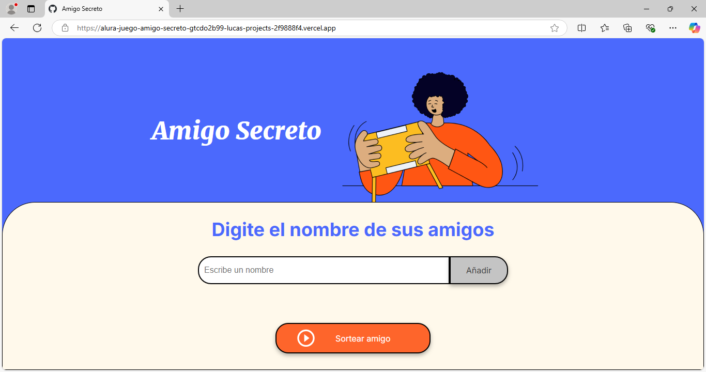
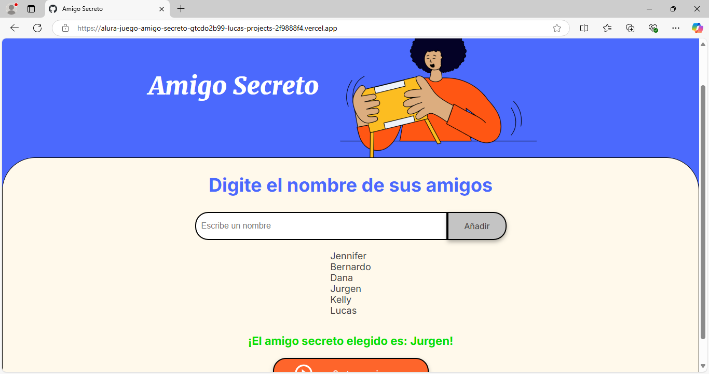

# Juego Amigo Secreto 🎁

¡Bienvenido al proyecto **"Juego Amigo Secreto"**! Este es un juego interactivo creado para sortear un amigo secreto de manera simple y divertida, ideal para reuniones, celebraciones o simplemente practicar lógica de programación. 🚀

## Descripción 📚

Este proyecto fue desarrollado como parte del programa educativo **Oracle ONE - Alura**.  
El diseño (HTML y CSS) fue proporcionado por Alura, mientras que la lógica en JavaScript fue creada desde cero para fortalecer habilidades de programación.

## Funcionalidades ✨

- Permite agregar nombres de amigos a una lista.
- Realiza un sorteo aleatorio para seleccionar el "amigo secreto".
- Interfaz amigable y responsiva.
  
## Tecnologías utilizadas 🛠️

- **HTML5**: Estructura del proyecto.
- **CSS3**: Estilización de la interfaz.
- **JavaScript**: Lógica para gestionar la lista y el sorteo.

## Requisitos ⚙️

Para ejecutar este proyecto, solo necesitas un navegador web moderno.  
No se requieren instalaciones adicionales.

## Cómo usar el proyecto 💻

1. **Clonar el repositorio**:
   ```bash
   git clone https://github.com/tu-usuario/Alura-Juego-Amigo-Secreto.git
   ```
2. **Abrir el archivo `index.html` en tu navegador**.
3. **Interacción**:
   - Ingresa los nombres de los participantes en el campo de texto y presiona "Añadir".
   - Una vez que tengas la lista, haz clic en "Sortear amigo" para conocer al amigo secreto elegido.

## Capturas de pantalla 📸

### Pantalla inicial


### Lista de amigos


### Resultado del sorteo



## Contribución 🤝

¡Toda sugerencia o mejora es bienvenida! Siéntete libre de abrir un **issue** o enviar un **pull request**.
